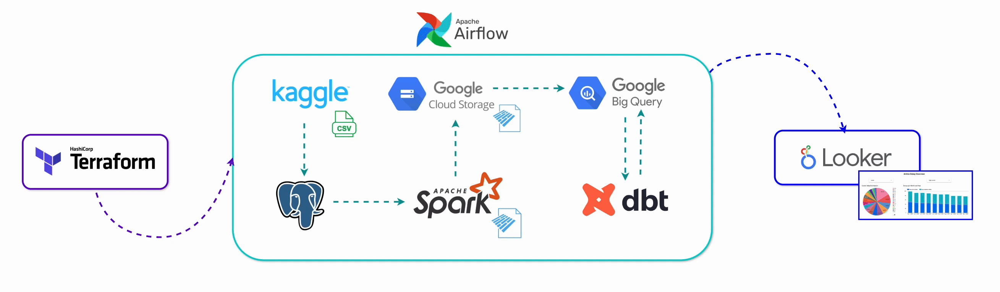

# de-zoomcamp-project

<p align="left">
  
</p>

**Project author:** Olha Krasnozhon

**Course:** [DataTalksClub Data Engineering Zoomcamp](https://github.com/DataTalksClub/data-engineering-zoomcamp)

## End-to-End Data Pipeline:




📌 All steps except the final dashboard are orchestrated via Apache Airflow, including:
- A single Spark job for cleaning & formatting the Postgres data
- Loading to GCS & BigQuery
- dbt transformations

## Setup

### Terraform

1.  Install `gcloud` (MacOS):
    ```bash
    brew install gcloud
    ```
2.  Set your GCP project ID (replace `terraform-demo-452019` with your actual project ID):
    ```bash
    gcloud config set project terraform-demo-452019
    ```
3.  Create a service account for Terraform:
    ```bash
    gcloud iam service-accounts create terraform-admin \
      --display-name "Terraform Admin"
    ```
4.  Grant the service account owner role (for demonstration purposes):
    ```bash
    gcloud projects add-iam-policy-binding terraform-demo-452019 \
      --member="serviceAccount:terraform-admin@terraform-demo-452019.iam.gserviceaccount.com" \
      --role="roles/owner"
    ```
    **Note:** In production environments, it is strongly recommended to grant only the necessary roles instead of the owner role. For example:
    -   `roles/storage.admin`
    -   `roles/bigquery.admin`
    -   `roles/iam.serviceAccountAdmin`
    -   `roles/iam.serviceAccountKeyAdmin`
5.  Create a credentials file (`gcp-creds.json`) for the service account in the `/terraform` directory:
    ```bash
    gcloud iam service-accounts keys create terraform/gcp-creds.json \
      --iam-account=terraform-admin@terraform-demo-452019.iam.gserviceaccount.com
    ```
6.  Copy the `gcp-creds.json` file to the root project's `keys` directory:
    ```bash
    cp terraform/gcp-creds.json keys
    ```
7.  Run Terraform commands to create the bucket and dataset in GCP:
    ```bash
    cd terraform
    terraform init
    terraform apply
    ```
Expected result:

<p align="left">
  
</p>

### Docker Compose:

To start all the relevant services defined `docker-compose.yml` file, run the following command:

```bash
docker-compose up --build -d
```

### Airflow Connections

Once the services are up and running, you need to create the required Airflow connections. You can do this either through the Airflow UI or by running commands manually.

**Option 1: Airflow UI**

1.  Open the Airflow UI: `http://localhost:8082`
2.  Navigate to `Admin` -> `Connections`.
3.  Add the following connections:

    * `google-cloud-default` (Google Cloud Platform)
    * `spark-default` (Spark)
    * `postgres-default` (PostgreSQL)

**Option 2: Manual Commands**

Alternatively, you can create the connections using the following `docker exec` commands:

1.  **Google Cloud Platform Connection:**
    ```bash
    docker exec -it de-zoomcamp-project-airflow-webserver-1 airflow connections add 'google-cloud-default' \
        --conn-type 'google_cloud_platform' \
        --conn-extra '{"extra__google_cloud_platform__key_path":"/opt/keys/gcp-creds.json","extra__google_cloud_platform__project":"terraform-demo-452019"}'
    ```
    **Note:** Ensure `terraform-demo-452019` reflects your GCP project ID.

2.  **Spark Connection:**
    ```bash
    docker exec -it de-zoomcamp-project-airflow-webserver-1 airflow connections add 'spark-default' \
        --conn-type 'spark' \
        --conn-host 'spark-master' \
        --conn-port '7077' \
        --conn-extra '{"spark-binary": "spark-submit", "deploy-mode": "client"}'
    ```

3.  **PostgreSQL Connection:**
    ```bash
    docker exec -it de-zoomcamp-project-airflow-webserver-1 airflow connections add 'postgres-default' \
        --conn-type 'postgres' \
        --conn-login 'airflow' \
        --conn-password 'airflow' \
        --conn-host 'postgres' \
        --conn-port '5432' \
        --conn-schema 'airline_data'
    ```

<p align="left">
  
</p>

**Trigger the Airflow DAG "airline_delay_pipeline"**:

<p align="left">
  
</p>

Successful DAG run:
<p align="left">
  
</p>

**Verification**

* **Airflow UI:** `http://localhost:8082` (username: `airflow`, password: `airflow`)
* **Spark UI:** `http://localhost:8080`

Expected result:
<p align="left">
  
</p>

* **PostgreSQL:** Verify the table content using the following command:
    ```bash
    docker exec -it de-zoomcamp-project-postgres-1 psql -U airflow -d airline_data -c "SELECT * FROM delayed_flights_raw LIMIT 10;" | less -S
    ```
Expected result:
<p align="left">
  
</p>

* **GCP Bucket and BigQuery Dataset:** Check the resources in the Google Cloud Console (Cloud Storage (--> Buckets) and BigQuery sections).

Expected results:
<p align="left">
  
</p>

<p align="left">
  
</p>

<p align="left">
  
</p>

<p align="left">
  
</p>

## Dashboard (Google Looker Studio):

This dashboard utilizes 2 target BigQuery tables:

* `airline_data.delays_by_carrier`
* `airline_data.delays_over_time`

These tables are queried within the Looker Studio dashboard to visualize the data.
The added resources in Looker (from "BigQuery"):

<p align="left">
  
</p>

Access the dashboard using the following link:
[https://lookerstudio.google.com/reporting/a8117be3-4133-49ca-9015-a316edd96f88](https://lookerstudio.google.com/reporting/a8117be3-4133-49ca-9015-a316edd96f88)


